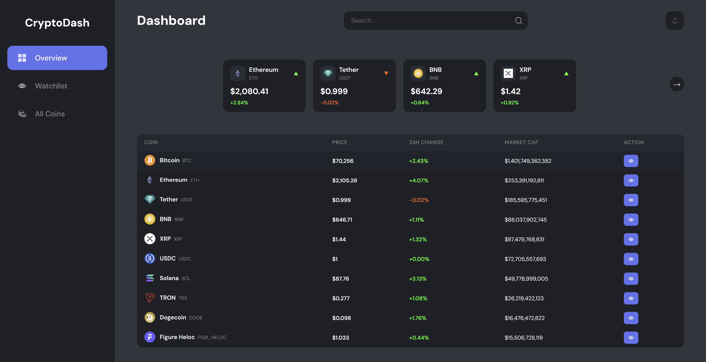
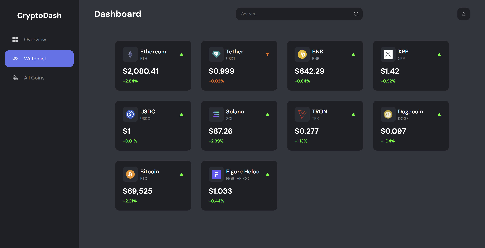
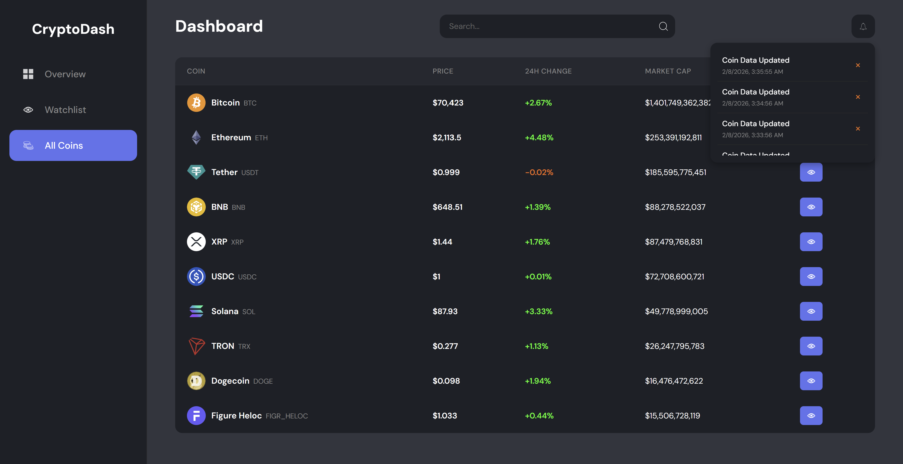

# CryptoDash

**Live Cryptocurrency Dashboard** *Project 2 of 5 in my React Learning Series*





## About The Project

CryptoDash is a real-time cryptocurrency dashboard built to track market trends for top digital assets. This project was designed to master **asynchronous data handling** and **side effects** in React.

Unlike a static Todo list, this app interacts with the outside world. It fetches live market data, updates automatically to reflect price changes, and persists user preferences even after the browser is closed.

### Key Features

* **Live Market Data:** Fetches real-time prices, market caps, and 24h trends using the [CoinGecko API](https://www.coingecko.com/en/api).
* **The "Pulse" (Auto-Refresh):** Implemented a polling mechanism that automatically updates data every 60 seconds without user intervention.
* **Persistent Watchlist:** Users can "Watch" specific coins. This list is saved to `localStorage`, so your favorites remain pinned even after refreshing the page.
* **Smart Search:** Real-time filtering allows users to instantly find coins by name.
* **Robust Error Handling:** Gracefully handles API rate limits (HTTP 429) and network failures with user-friendly error messages.

## Technologies Used

* **Framework:** React 18 (via Vite)
* **Styling:** CSS3 (Custom Grid & Flexbox layouts)
* **State Management:** React `useState` & `useEffect` hooks
* **Data Source:** CoinGecko Public API

## Key Learnings & Concepts

This project focused on moving beyond static UI into dynamic, data-driven applications.

### 1. Asynchronous Data Fetching
Learned to manage the "Loading," "Success," and "Error" states of an application.
```javascript
useEffect(() => {
  const fetchCoins = async () => {
    try {
      setLoading(true);
      const response = await fetch(API_URL);
      const data = await response.json();
      setCoins(data);
    } catch (err) {
      setError(err.message);
    } finally {
      setLoading(false);
    }
  };
  fetchCoins();
}, []);
